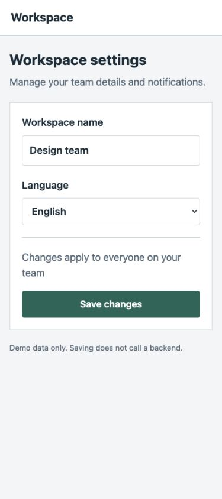
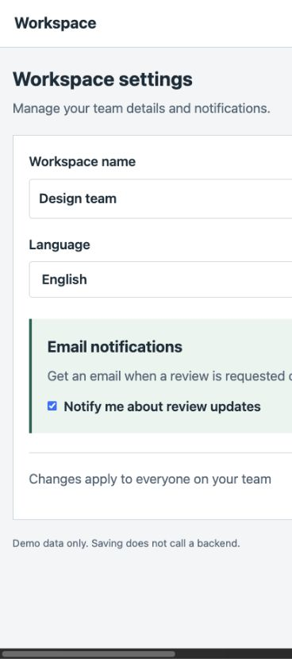

# PR Visual Review

English · [日本語](README.ja.md)

**Turn a pull request into before/after screenshots and a visual review report.**

Ask Codex or Claude Code to inspect a PR. The agent reads the diff, chooses the relevant screens, runs both revisions, and captures matching states in your browser. You get screenshots, findings, and an explicit list of what was not verified.

## From a request to review evidence

**1. Ask for the review.**

```text
$pr-visual-review Review PR #123 on desktop and mobile (375px).
Check the new notification settings and the state after saving.
Write the report in English. Keep the results local.
```

**2. The agent selects screens from the diff and inspects both revisions.**

It identifies the settings page, starts the base and head in separate worktrees, matches the viewport and data, and checks the changed controls. No prewritten Playwright test is required.

**3. Read the generated report.**


This public demo uses a small local app with an intentional mobile regression. The screenshots are real Chrome captures and the report is generated by the bundled renderer. PR #123 is an illustrative identifier, **not a live GitHub PR**.

| What the report shows | Evidence from this demo |
| --- | --- |
| Expected change | The new email notification controls appear on desktop. |
| Action required | On mobile, the form becomes wider than the screen and the Save button moves off-screen. |
| Not verified | The demo has no backend, so the post-save success state cannot be checked. |

### The finding, not just the changed pixels

The Before screen fits within 375px. In After, the document is 616px wide and the Save button starts beyond the viewport. The report separates this regression from the expected addition of notification controls.

| Before: Save is visible | After: Save is off-screen |
| --- | --- |
|  |  |

[Read the report](examples/demo/report.md) · [Reproduce the demo](examples/demo/README.md) · [Validation notes](examples/validation.md)

## Install

You need Git, Python **3.10+**, your app's runtime, and an agent environment that can control a browser and export screenshots. Installing this skill does not install a browser connection.

macOS / Linux example:

```bash
mkdir -p ~/src
git clone https://github.com/vexus2/pr-visual-review.git ~/src/pr-visual-review
cd ~/src/pr-visual-review

# Codex
mkdir -p ~/.agents/skills
ln -s "$PWD/pr-visual-review" ~/.agents/skills/pr-visual-review

# Claude Code
mkdir -p ~/.claude/skills
ln -s "$PWD/pr-visual-review" ~/.claude/skills/pr-visual-review
```

Do not overwrite an existing skill without inspecting it. You can also copy the entire `pr-visual-review/` directory, or install it in a project's `.agents/skills/` or `.claude/skills/`. Copies need manual updates. Windows installation has not been verified.

Open a new session and invoke `$pr-visual-review` in Codex or `/pr-visual-review` in Claude Code. See the official [Codex skill documentation](https://developers.openai.com/codex/skills) and [Claude Code skill documentation](https://code.claude.com/docs/en/skills).

## Choose what to review

```text
$pr-visual-review Review PR #123 on desktop only. Keep results local.
$pr-visual-review Review PR #123 on mobile only, at 375px.
$pr-visual-review Review PR #123 on desktop and mobile.
$pr-visual-review Review PR #123 and attach the screenshots to that PR.
```

- **Desktop / mobile / both:** review only the requested devices. Excluded devices are not counted as unverified.
- **Viewport:** explicit dimensions take priority, followed by project conventions. Fallbacks are desktop 1280×1000 and mobile 390×844 CSS pixels. If unspecified, the skill starts with desktop only and states that assumption.
- **Mobile means viewport testing:** it does not imply a physical phone or touch-device test.
- **Comparison:** Before defaults to the merge base of the PR head and the target-branch snapshot. You can request another base, such as current main. Exact SHAs are recorded.
- **Language:** request English or Japanese. Set `language` to `en` or `ja` in report.json; omitted values preserve the legacy Japanese labels. The renderer translates labels, not your findings.

A request to “review” creates local results. A request to “attach screenshots to the PR” also authorizes publication to that PR. Reruns update the skill's own comment, never someone else's.

## Configure login

Give instructions directly:

```text
Review PR #123 on desktop. Open /signin and let me log in.
Then inspect /settings/site with the site-admin role.
```

Or place a recipe at the target project's `.pr-visual-review.json` and say:

```text
Use .pr-visual-review.json for login. Review PR #123 on mobile only.
```

Supported modes: existing session, form login, manual login, development fixture, and no login. Current instructions take priority over an explicitly selected config, then the project's config, then existing project guidance.

Copy the [configuration example](pr-visual-review/templates/auth.example.json). Reference environment variable names or keys in a local JSON file; do not put password values in the skill or recipe. The agent checks identity, role, and comparison data separately on Before and After. Reports record only the mode and verification statuses.

```bash
python3 /PATH/TO/SKILL/scripts/auth_config.py /PATH/TO/PROJECT/.pr-visual-review.json
```

This validates the recipe. It does **not** read credentials or log in. Detailed [authentication guidance](pr-visual-review/references/authentication.md) is currently in Japanese.

## Output

A run produces screenshots plus `report.json`, `report.md`, and `report.html`.

The report distinguishes **introduced**, **worsened**, **pre-existing**, and **unestablished** causes, with separate **required**, **optional**, and **investigate** priorities. Existing overflow or ordinary text wrapping is not automatically a blocker for the current PR.

Generate both views from the same evidence record:

```bash
python3 /PATH/TO/SKILL/scripts/review.py render /PATH/TO/RUN/report.json > /PATH/TO/RUN/report.md
python3 /PATH/TO/SKILL/scripts/review.py render /PATH/TO/RUN/report.json --format html > /PATH/TO/RUN/report.html
```

Keep HTML next to report.json and its images. GitHub displays HTML source; clone/download the example to view it in a browser. Read the [report format](pr-visual-review/references/report-format.md) for details (Japanese).

## Browser support and publication

| Capability | Status |
| --- | --- |
| Codex + real Chrome: local startup, capture, and report | Verified with the bundled local fixtures |
| Markdown/HTML, device scope, login config validation | Implemented and covered by automated tests |
| Claude Code | Adapter instructions provided; live operation not yet verified |
| GitHub comment create/update | Implemented and tested with a fake API; live posting not yet verified |
| Screenshot upload | Requires your browser's attachment support or an explicitly chosen image host; no uploader is bundled |
| Safari | Requires an available real Safari automation surface; not yet verified. WebKit is not labeled Safari |

Posting through the helper requires authenticated `gh` access to github.com. The `publish` command is a dry run unless `--execute` is supplied. Uploaded images must be reviewed and accessible to PR readers. See [publication instructions](pr-visual-review/references/publishing.md) (Japanese).

If capture succeeds but upload is unavailable, the agent keeps local artifacts and reports publication as incomplete. Preparing Markdown is not treated as successfully posting images.

## Limits and data handling

This is a skill and small helper scripts, not a complete visual regression test system. Screen selection can miss affected states. A clean report does not prove that every page, feature, or security property is correct.

The project does not operate an image-hosting service. Its helper scripts and generated HTML contain no custom analytics or telemetry. Your AI host, browser integration, app, GitHub, and chosen image host have their own networking and data policies. Keep credentials and customer data out of artifacts and public issues.

Pixel diffs, CI orchestration, GitHub Enterprise, and a dedicated Safari driver are outside the current scope. Direct `file://` preview was blocked by the development browser tool; HTML rendering was checked over loopback HTTP.

## Update

For a symlink installation:

```bash
git -C ~/src/pr-visual-review pull --ff-only
```

Review local changes before updating. Do not discard edits to force an update. Sessions that already loaded the skill should be asked to reread SKILL.md and its references. Copies and installations on other machines need separate updates.

## Contribute

```bash
python3 -m unittest discover -s tests -v
```

The tests use Python's standard library, do not post to GitHub, and do not need a browser. Reproducible reports about browser integrations and PR publication are especially useful. See [CONTRIBUTING.md](CONTRIBUTING.md) and [validation notes](examples/validation.md) (currently Japanese).

## License

[MIT](LICENSE).
