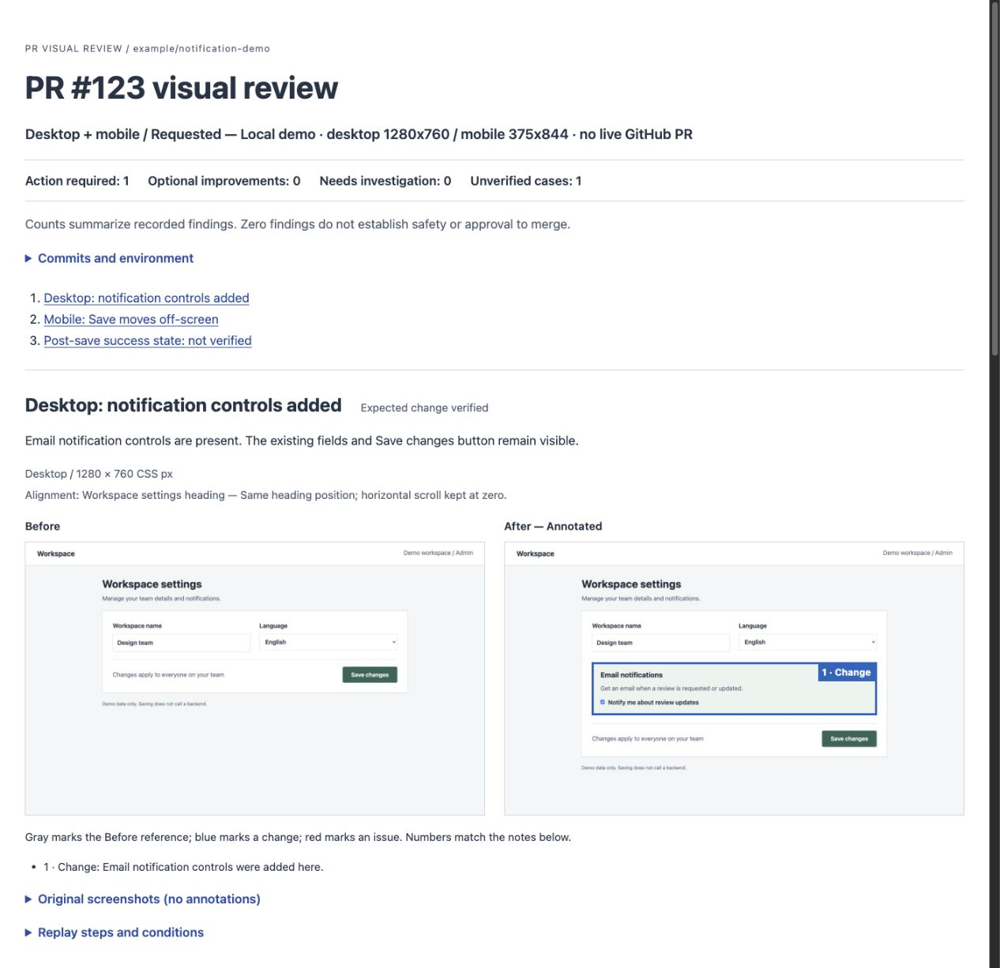
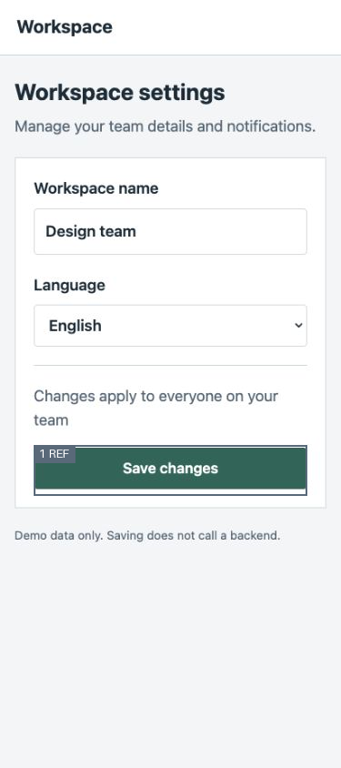
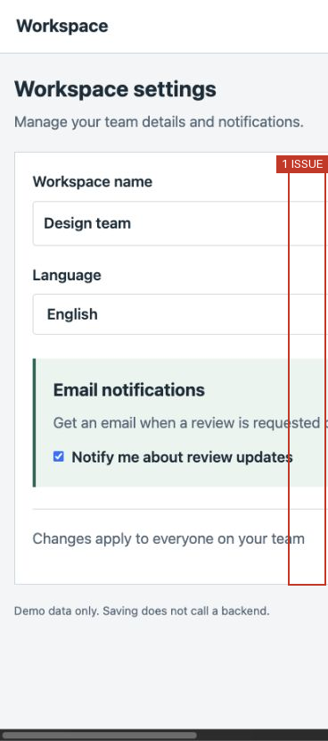

# PR Visual Review

English · [日本語](README.ja.md)

**Turn a pull request into before/after screenshots and a visual review report.**

A plugin for Codex and Claude Code that bundles the review skill and local helpers.

Ask Codex or Claude Code to inspect a PR. The agent reads the diff, selects the relevant screens, runs both revisions, and captures matching states in your browser. You get screenshots, findings, and an explicit list of what was not verified.

## How it works

**1. Ask for the review.**

```text
$pr-visual-review Review PR #123 on desktop and mobile (375px).
Check the new notification settings and the state after saving.
Write the report in English. Keep the results local.
```

**2. The agent selects screens from the diff and inspects both revisions.**

It identifies the settings page, starts base and head in separate worktrees, matches the viewport and data, and checks the changed controls. No prewritten Playwright test is required.

**3. Read the report.**



This public demo uses a small local app with an intentional mobile regression. The screenshots are real Chrome captures and the report is generated by the bundled renderer. PR #123 is an illustrative identifier, **not a live GitHub PR**.

| What the report shows | Evidence from this demo |
| --- | --- |
| Expected change | The new email notification controls appear on desktop. |
| Action required | On mobile, the form becomes wider than the screen and the Save button moves off-screen. |
| Not verified | The demo has no backend, so the post-save success state cannot be checked. |

### A mobile regression

The Before screen fits within 375px. In After, the document is 616px wide and the Save button starts beyond the viewport. The report separates this regression from the expected addition of notification controls.

| Before: Save is visible | After: Save is off-screen |
| --- | --- |
|  |  |

Blue frames mark changes, red frames mark issues, and gray frames show the Before reference. Numbers connect each frame to its explanation. The AI chooses the regions after inspecting the images; this is not automatic pixel-diff detection. Original captures: [Before](examples/demo/images/sp-before.jpg) · [After](examples/demo/images/sp-after.jpg).

[Read the report](examples/demo/report.md) · [Reproduce the demo](examples/demo/README.md) · [Validation notes](examples/validation.md)

## Install the plugin

### Codex

In a terminal with the Codex CLI installed:

```bash
codex plugin marketplace add vexus2/pr-visual-review
codex plugin add pr-visual-review@pr-visual-review-marketplace
```

Start a new Codex session, select **PR Visual Review** in the plugin picker if available, and ask it to review a PR. The bundled skill is named `pr-visual-review`.

### Claude Code

In a terminal:

```bash
claude plugin marketplace add vexus2/pr-visual-review
claude plugin install pr-visual-review@pr-visual-review-marketplace
```

Start a new session or run `/reload-plugins`, then invoke:

```text
/pr-visual-review:pr-visual-review Review PR #123 on desktop and mobile. Keep results local.
```

The examples below use the Codex skill name `$pr-visual-review`. In Claude Code, use the namespaced command above, or ask for PR Visual Review in plain language.

### Requirements

The plugin packages the workflow; it does not install a browser connection, Python, or your app's runtime. You need Git, Python **3.10+**, your app's dependencies, and a browser tool that can export screenshots. Annotated PNG export also requires optional Pillow. No hooks or MCP servers are bundled.

The initial packaging targets Codex CLI **0.158.0** and Claude Code **2.1.284**. Older clients may not support these commands. This is a public repository marketplace, not an official directory listing from either vendor. Windows operation has not been verified.

## Choose what to review

```text
$pr-visual-review Review PR #123 on desktop only. Keep results local.
$pr-visual-review Review PR #123 on mobile only, at 375px.
$pr-visual-review Review PR #123 on desktop and mobile.
$pr-visual-review Review PR #123 and attach the screenshots to that PR.
```

- **Desktop / mobile / both:** Review only the requested devices. Excluded devices are not counted as unverified.
- **Viewport:** Explicit dimensions take priority, followed by project conventions. Fallbacks are desktop 1280×1000 and mobile 390×844 CSS pixels. If unspecified, the skill starts with desktop only and states that assumption.
- **Mobile means viewport testing:** It does not imply testing on a physical phone or touch device.
- **Comparison:** Before defaults to the merge base of the PR head and the target-branch snapshot. You can request another base, such as current main. Exact SHAs are recorded.
- **Language:** Request English or Japanese. Set `language` to `en` or `ja` in report.json; omitted values preserve the legacy Japanese labels. The renderer translates labels, not your findings.

A request to “review” creates local results. A request to “attach screenshots to the PR” also authorizes publication to that PR. Reruns update the skill's own comment, never someone else's.

## Configure login

Give instructions directly:

```text
Review PR #123 on desktop. Open /signin and let me log in.
Then inspect /settings/site with the site-admin role.
```

Or place a recipe at the target project's `.pr-visual-review.json` and say:

```text
Use .pr-visual-review.json for login. Review PR #123 on mobile only.
```

Supported modes: existing session, form login, manual login, development fixture, and no login. Current instructions take priority over an explicitly selected config, followed by the project config, then existing project instructions.

Copy the [configuration example](skills/pr-visual-review/templates/auth.example.json). Reference environment variable names or keys in a local JSON file; do not put password values in the skill or recipe. The agent checks identity, role, and comparison data separately on Before and After. Reports record only the mode and verification statuses.

```bash
python3 /PATH/TO/SKILL/scripts/auth_config.py /PATH/TO/PROJECT/.pr-visual-review.json
```

This validates the recipe. It does **not** read credentials or log in. Detailed [authentication guidance](skills/pr-visual-review/references/authentication.md) is currently in Japanese.

## Output

A run produces screenshots plus `report.json`, `report.md`, and `report.html`. Changed areas and UI problems can be marked with numbered frames. Original screenshots remain unchanged. The HTML report overlays frames on the originals; Markdown and GitHub comments use separate annotated PNGs.

The report distinguishes **introduced**, **worsened**, **pre-existing**, and **unestablished** causes, with separate **required**, **optional**, and **investigate** priorities. Existing overflow or ordinary text wrapping is not automatically a blocker for the current PR.

For reports without annotations, generate both views from the same report data:

```bash
python3 /PATH/TO/SKILL/scripts/review.py render /PATH/TO/RUN/report.json > /PATH/TO/RUN/report.md
python3 /PATH/TO/SKILL/scripts/review.py render /PATH/TO/RUN/report.json --format html > /PATH/TO/RUN/report.html
```

For annotated screenshots in Markdown or a PR, install the optional PNG dependency in your Python environment and export the marked copies first:

```bash
python3 -m pip install -r /PATH/TO/SKILL/requirements-annotations.txt
python3 /PATH/TO/SKILL/scripts/review.py annotate /PATH/TO/RUN/report.json --out /PATH/TO/RUN/report.annotated.json
python3 /PATH/TO/SKILL/scripts/review.py render /PATH/TO/RUN/report.annotated.json > /PATH/TO/RUN/report.md
python3 /PATH/TO/SKILL/scripts/review.py render /PATH/TO/RUN/report.annotated.json --format html > /PATH/TO/RUN/report.html
```

Use the derived JSON for publication too. Upload both the original and annotated images. The helper checks that the marked PNG still matches its source and region definitions. HTML overlays work without Pillow; missing PNGs or upload URLs block annotated PR publication. See [annotation instructions](skills/pr-visual-review/references/annotations.md) (Japanese).

Keep HTML next to report.json and its images. GitHub displays HTML source; clone or download the example to view it in a browser. Read the [report format](skills/pr-visual-review/references/report-format.md) for details (Japanese).

## Browser and PR publishing

Chrome is the default browser. Safari checks require a connection to real Safari; WebKit results are not presented as Safari results.

Posting uses authenticated `gh` access to github.com and either your browser's image attachment feature or an image host you specify. No uploader is bundled. If upload is unavailable, the agent keeps the screenshots and report locally.

Live PR image posting has not yet been verified. See the [validation notes](examples/validation.md) for the checks completed so far, including browser integrations. The helper's `publish` command is a dry run unless `--execute` is supplied; see the [publication instructions](skills/pr-visual-review/references/publishing.md) for details (Japanese).

## Update the plugin

### Claude Code: optional auto-updates

Open `/plugin`, go to **Marketplaces**, select **pr-visual-review-marketplace**, and choose **Enable auto-update**. Third-party marketplaces have auto-update off by default; the publisher cannot turn it on for you.

When an update is downloaded, run `/reload-plugins` to use it in the current session, or start a new session. To update manually:

```bash
claude plugin marketplace update pr-visual-review-marketplace
claude plugin update pr-visual-review@pr-visual-review-marketplace
```

### Codex

Refresh this catalog and install its current plugin version:

```bash
codex plugin marketplace upgrade pr-visual-review-marketplace
codex plugin add pr-visual-review@pr-visual-review-marketplace
```

Start a new session after updating. Automatic background update timing depends on the Codex client and is not guaranteed here. Releases bump the plugin version; see [CHANGELOG.md](CHANGELOG.md).

## Developing the plugin

Clone the repository when you want to edit it:

```bash
git clone https://github.com/vexus2/pr-visual-review.git
cd pr-visual-review
claude --plugin-dir .
```

For Codex, add the checkout as a local marketplace with `codex plugin marketplace add .`. Local development sources and GitHub sources with the same marketplace name should not be registered simultaneously. Save your local changes before switching sources or pulling updates.

The workflow lives in `skills/pr-visual-review/` as real files so plugin caches can load it. See [plugin maintenance](docs/plugin-maintenance.md) for packaging and release steps.

## Contribute

```bash
python3 -m unittest discover -s tests -v
```

Core tests use Python's standard library. PNG export tests also need the optional Pillow dependency and are skipped without it. The tests do not post to GitHub and do not need a browser. Reproducible reports about browser integrations and PR publication are especially useful. See [CONTRIBUTING.md](CONTRIBUTING.md) and [validation notes](examples/validation.md) (currently Japanese).

## License

[MIT](LICENSE)
